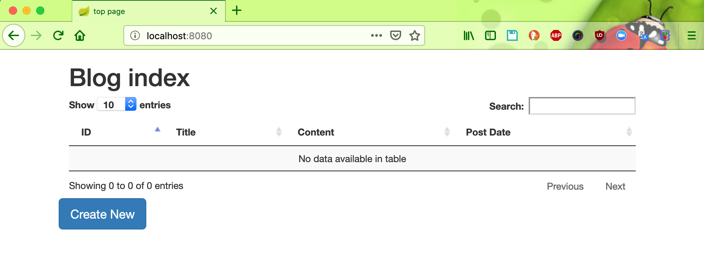
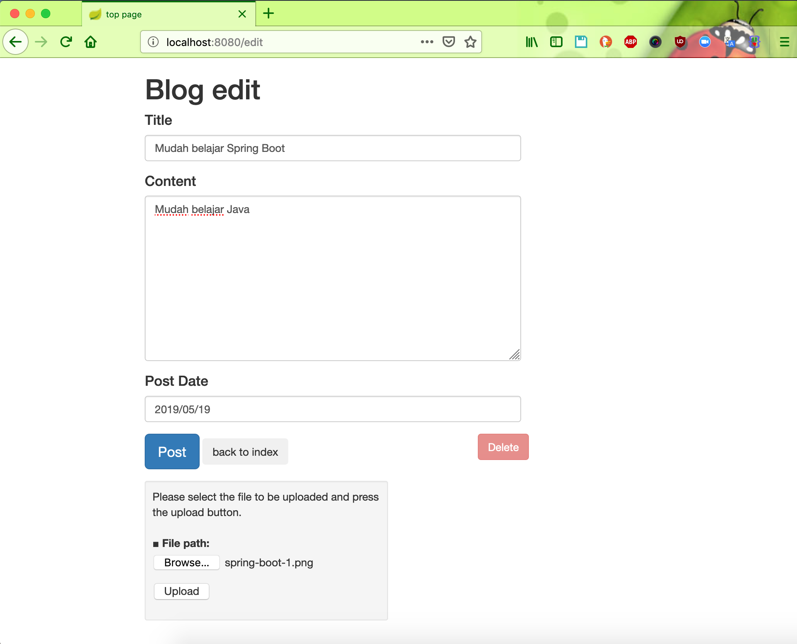
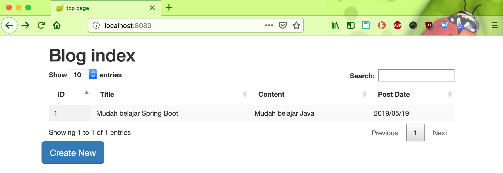

# springboot-blog-sample

## Things to do:

* Clone this repository: git clone https://github.com/hendisantika/springboot-blog-sample.git
* Go to the folder: cd springboot-blog-sample
* Run the application: mvn clean spring-boot:run
* Open your favorite browser: http://localhost:8080

## Screen shot

Home Page

Add Post

List All Posts

